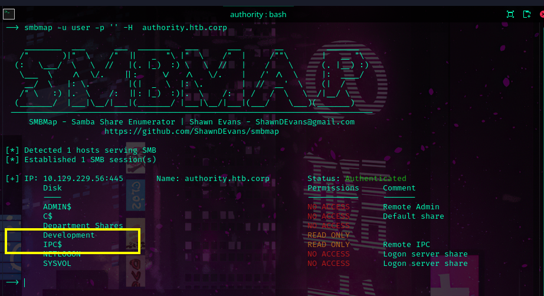

[scans](scans.md)

Domain name:  authority.htb  
DC FQDN: authority.authority.htb  
Alternative DNS: htb.corp
IIS 10.0 on port 80.  
PWM v2.0.3 is running on 8443

[dns](dns.md)

Confirmed domain and FQDN. 
Added target as our dns resolver. 

[ntp](ntp.md)

Fixed time skew to avoid problems with kerberos.

> [!NOTE] First Objective: Account compromise
> Here we need to compromise any account 
> in order to get a better understanding of the domain structure. 

[smb](smb.md)

We have access on the Development share that could contain sensitive info. 

