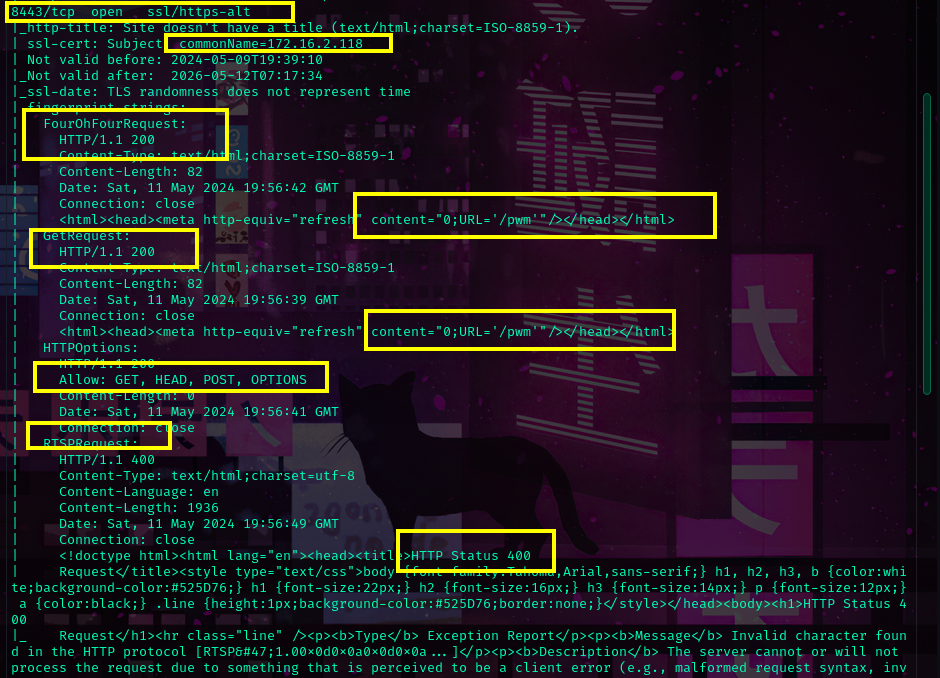

You can download the pdf containing the full walkthrough from: [report](authority_report.pdf)

#### Summary

[scans](scans.md)

Domain name:  authority.htb  
DC FQDN: authority.authority.htb  
Alternative DNS: htb.corp.  
IIS 10.0 on port 80.  
PWM v2.0.3 is running on 8443  

[dns](dns.md)

Confirmed domain and FQDN  
Added target as our dns resolver. 

[ntp](ntp.md)

Fixed time skew to avoid problems with kerberos.

> First Objective: Account compromise  
> 
> Here we need to compromise any account  in order to get a better understanding of the domain structure. 

[smb](smb.md)

We have access on the Development share that could contain sensitive info. 

We found a few ansible playbooks. Including pwm which had the encrypted AES256 password for the PWM's administration panel.

[pwm](pwm.md)

>  Objective: Account Compromise  
>  
>  We were able to compromise the PWM's admin account by extracting its encrypted password from a ansible playbook and decrypting it with john.
>   
>  After that we're able  to compromise the ldap proxy user svc_ldap by changing some configurations parameters of the PWM service.  

[bloodhound](bloodhound.md)

We are able to access the DC using our svc_ldap. 

> Second Objective: Find a Privilege Escalation Path
> 
> Here we  want to user the account we've compromise to find a path to become system or domain admin. 

[dc](DC.md)

We got a clue on how to  privesc. But it has something to due with ADCS.  
I'm gonna need to study a bit how it works before going back to the box.

[LAB](LAB.md)  

Found a few resources that teach how ADCS exploitation works, including a full 
THM room  that explain the basics step-by-step. 

> Third  Objective:  Privilege Escalation
> 
>Now we're gonna use all the intel and experience we got during the labs to become domain admin or system.
 

[privesc](privesc.md)

We were able to use what we've learnt from THM to privesc in the box. It was hard at least for me. And I had to do a lot of research online and learn new techniques on the go even though the privesc path is pretty much the same we saw on the THM lab.

That's all folks! happy hacking ❤️

