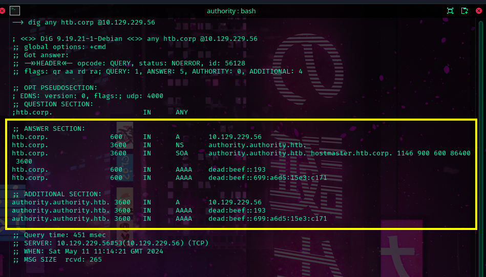
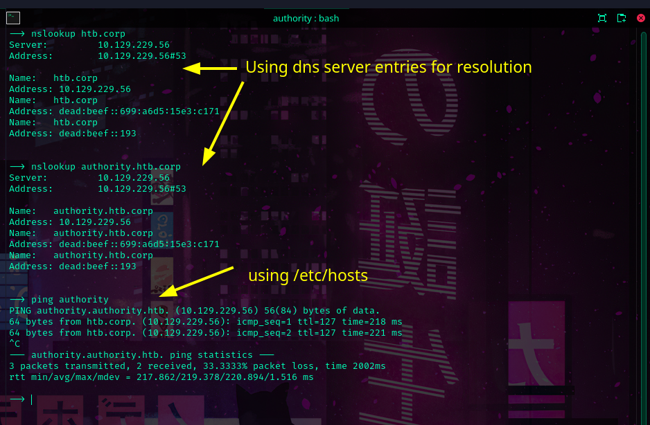

```sh
dig any htb.corp @10.129.229.56
```


---

**Configuring DNS Resolution For Engagement**

	10.129.229.56 htb.corp.
	10.129.229.56 authority.authority.htb. authority

/etc/hosts


**Let's define a new dns server** 

	We don't wanna NetworkManager resetting our configs right?
```
sudo systemctl stop NetworkManager
```
```
sudo rm -f /etc/resolv.conf
```
	search htp.corp
	nameserver 10.129.229.56
	nameserver 1.1.1.1

/etc/resolv.conf


	This might be needed if you don't want systemd to automatically load NetworkManager and overwrite your settings.
```
sudo chattr +i /etc/resolv.conf
```


---

**Running a few dns lookups**


