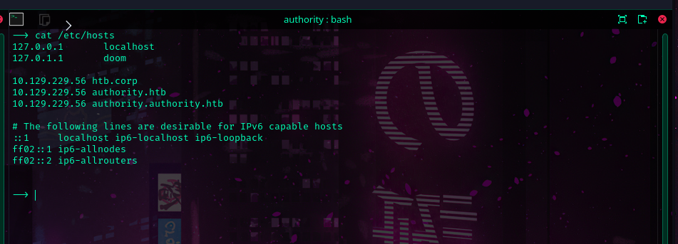
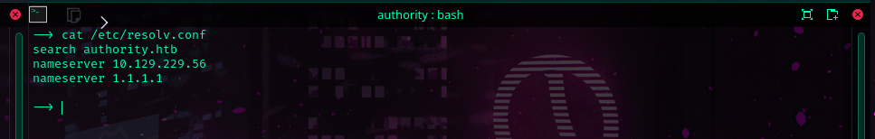

I was a bit confused by a few results  I got and had to run this step twice.

```sh
dig any authority.htb @10.129.12.250
```

```
dig any htb.corp @10.129.12.250
```


```
authority.htb.           600    IN      A       10.129.12.250
authority.authority.htb. 3600   IN      A       10.129.12.250
htb.corp.               600     IN      A       10.129.12.250
```

---


**Configuring DNS Resolution For Engagement**



**Let's define a new dns server** 

We don't wanna NetworkManager resetting our configs right?
```sh
sudo systemctl stop NetworkManager
```



This might be needed if you don't want systemd to automatically load NetworkManager and overwrite your settings.
```sh
sudo chattr +i /etc/resolv.conf
```


---

**Running a few tests **

```
dig ns authority.htb
```


```
nslookup authority
```

