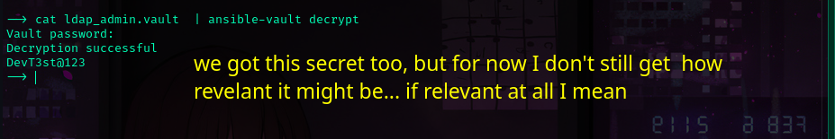

Now that we have a general direction. The next question is.. where is the next clue ?


https://github.com/pwm-project/pwm


Now, we know exactly which version of PWN we're running. and there's no exploit available  in the wild for pwm v2.03


Awesome,  we've made progress.. and now how do we decrypt it ? 

 I found this two resources online that were useful
https://www.bengrewell.com/cracking-ansible-vault-secrets-with-hashcat/
https://ppn.snovvcrash.rocks/pentest/infrastructure/devops/ansible

We extracted the vaults blob containing the encrypted password and cracked the secret AES key using john.

```sh
ansible2john pwd.vault | tee pwd.hash
```
```sh
john --wordlist=/usr/share/wordlists/rockyou.txt  pwd.hash
```

	AES Decryption Key: !@#$%^&*


We need to install ansible to get access to the ansible-vault command
```sh
sudo apt install -y ansible 
```

And we've compromised a login using the secret key!
```
username: svc_pwm@authority.htb
password: pWm_@dm!N_!23
```


Now have access to pwm's config editor!


How about the ldap admin vault ?


```
DevT3st@123
```

---

_We got some bad news! svc_pwm is not a domain user_


However, now we have access to pwm admins interface. Let's see what we can do

