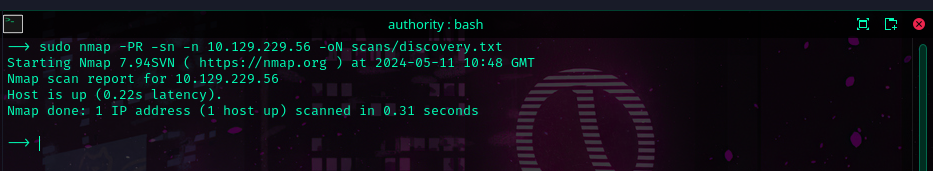
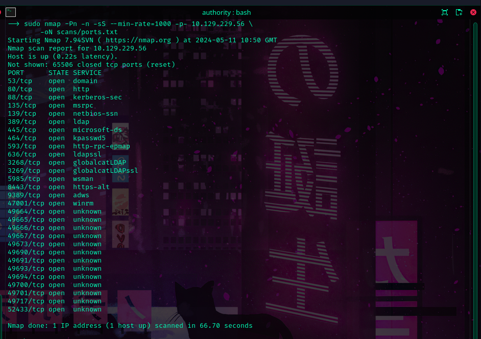
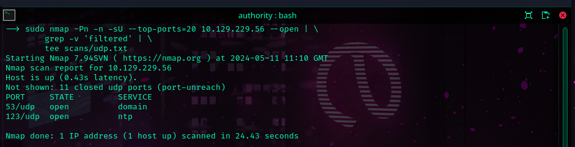
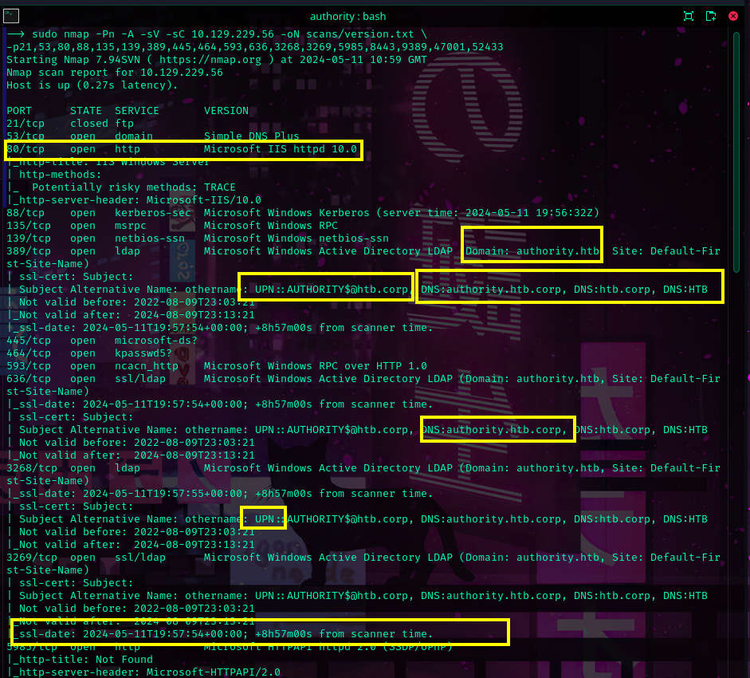
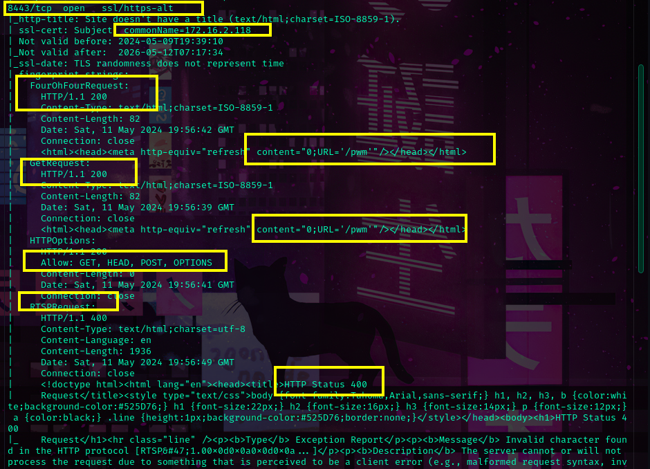
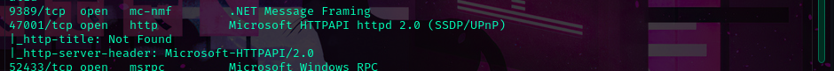
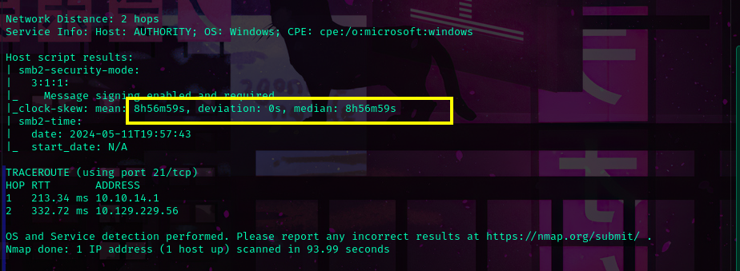

**Host Discovery**
```sh
sudo nmap -PR -sn -n 10.129.229.56 -oN scans/discovery.txt
```


---

**Open TCP Ports Enumeration**
```sh
sudo nmap -Pn -n -sS --min-rate=1000 -p- 10.129.229.56 \
	-oN scans/ports.txt
```


---

**UDP Scan: Common Ports**
```sh
sudo nmap -Pn -n -sU --top-ports=20 10.129.229.56 --open | \
	grep -v 'filtered' | \
	tee scans/udp.txt
```


---

**Version Scan**
```sh
sudo nmap -Pn -A -sV -sC 10.129.229.56 -oN scans/version.txt \
-p21,53,80,88,135,139,389,445,464,593,636,3268,3269,5985,8443,9389,47001,52433
```



